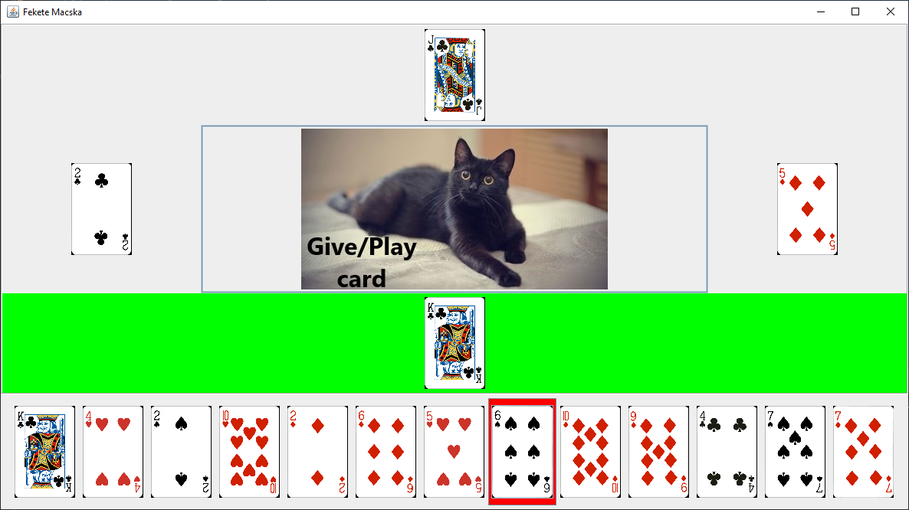

# Fekete-Macska-Prog3
This is my submission for 'Programozás alapjai 3' class at BME-VIK. Made in Java, using Swing for UI.

'Fekete Macska' is a card game for 4 players, where your goal is to get the least amount of points. Each player starts with 13 cards, then everyone passes 3 cards of choice to the next player. Each round each player plays 1 card, and the one with the strongest takes all.

